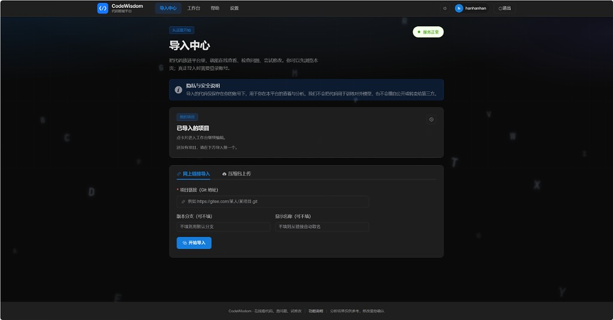

# CodeWisdom AI

> Java 微服务 + Vue3 工作台：项目导入 · 静态审计 · 架构图 · LLM 修复/HITL · 可控 Agent（跳转 / 补注释 / 需求澄清）

**全链路代码智能治理平台**（面向研发团队，默认不自动改库）

[](http://47.93.158.48/)
[](https://gitee.com/han-jiajiemm/CodeWisdom)
[](https://openjdk.org/)
[](https://spring.io/projects/spring-boot)
[](https://vuejs.org/)

## 界面预览

<p align="center">
  <a href="docs/images/import-center@2x.png" title="点击查看高清原图">
    
  </a>
</p>

<p align="center">
  <sub>导入中心</sub>
</p>

---

## 在线体验

| 入口 | 地址 |
|------|------|
| **Web 工作台** | [http://47.93.158.48/](http://47.93.158.48/) |
| **API 网关** | `http://47.93.158.48:8080/api/` |

**快速试用（约 2 分钟）**

1. 注册 / 登录
2. 打开 **导入中心** → 粘贴 Gitee 公开仓库（例如 `https://gitee.com/y_project/RuoYi.git`）→ 导入
3. 进入 **项目工作台** → **检查代码** → 查看审计结果
4. 打开 Java 文件，尝试：
   - **一键补充注释**（全文件 / 可见区 / 选中代码）
   - 侧栏 AI：「帮我找到 `xxx` 方法并跳转」

> 演示环境为共享实例，请勿上传敏感代码。默认 **不自动修改仓库**，修复与 Agent 操作需人工确认。

---

## 核心能力

| 模块 | 能力 |
|------|------|
| **多源导入** | Git（Gitee 已完整验证）、ZIP 安全解压、文件树与分类统计 |
| **静态分析** | Tree-Sitter 解析 Java 结构；架构逆向与 Mermaid 图 |
| **缺陷审计** | 规则扫描、风险分级、文件树问题密度、审计历史对比 |
| **智能修复** | LLM 改法建议、结构化 Diff、HITL 批准/驳回/修改 |
| **文档注释** | Javadoc 生成并写入编辑器（已有注释跳过） |
| **工作台 Agent** | 聊天 + 结构化动作：`NAVIGATE` 跳转、`JAVADOC` 补注释、`CLARIFY` 需求澄清 |
| **运行与评测** | 运行能力判定、沙箱校验、量化评测报告 |

---

## 架构一览

```
Vue3 前端 ──▶ gateway (8080) ──▶ Nacos / Sentinel
                    │
     ┌──────────────┼──────────────┬─────────────────┐
     ▼              ▼              ▼                 ▼
project-resource  code-analysis  agent-orchestration  evaluation-export
  (8081)            (8082)           (8083)              (8084)
     │              │              │                     │
     └──────────────┴──────────────┴─────────────────────┘
                           │
              MySQL · Redis · MinIO · RabbitMQ
```

- **设计原则**：能规则/静态分析解决的不用 LLM；LLM 负责理解、生成与建议；写操作走 **白名单 Agent Action + 人工确认**。
- 详细设计见 [`docs/architecture.md`](docs/architecture.md)。

---

## 技术栈

| 层级 | 选型 |
|------|------|
| 后端 | Java 17、Spring Boot 3.5、Spring Cloud 2025、MyBatis-Plus |
| 解析 | [tree-sitter](https://github.com/tree-sitter/tree-sitter)（Java 绑定） |
| 编排 | LangGraph4j（状态图已验证；生产主链路持续演进中） |
| 前端 | Vue 3、Vite、Element Plus、Monaco Editor |
| 中间件 | MySQL 8、Redis 7、MinIO、RabbitMQ、Nacos |
| 部署 | Docker Compose + systemd + Nginx |

---

## 本地开发

### 环境要求

- JDK **17**
- Maven **3.9+**
- Node.js **18+**（仅前端）
- Docker（本地中间件，可选）

### 1. 启动中间件

```bash
docker compose up -d
docker compose ps   # 期望 5 个容器 healthy
```

### 2. 启动后端

```bash
mvn clean verify    # 全量测试（基线 421 个）
mvn package -DskipTests

# 各服务使用 local profile，按模块启动，例如：
mvn -pl codewisdom-gateway spring-boot:run -Dspring-boot.run.profiles=local
# project-resource / code-analysis / agent-orchestration / evaluation-export 同理
```

网关默认：`http://localhost:8080`

### 3. 启动前端

```bash
cd codewisdom-ui
cp .env.example .env.development   # 按需改 API 地址
npm install
npm run dev                        # http://localhost:5173
```

更多细节见 [`docs/deployment.md`](docs/deployment.md)、[`codewisdom-ui/README.md`](codewisdom-ui/README.md)。

---

## 部署到服务器

```powershell
# 仓库根目录（PowerShell）
.\deploy\update-ecs.ps1                          # 更新全部 Java 服务
.\deploy\update-ecs.ps1 -Service agent-orchestration   # 仅更新单个服务
.\deploy\deploy-frontend.ps1                     # 构建并上传前端到 Nginx
```

服务器自检：`bash /opt/codewisdom/deploy/server-verify.sh`

---

## 仓库结构

```
CodeWisdom/
├── codewisdom-gateway/              # API 网关
├── codewisdom-project-resource/     # 项目导入、文件树、MinIO
├── codewisdom-code-analysis/        # Tree-Sitter、架构、审计
├── codewisdom-agent-orchestration/  # 聊天 Agent、文档、修复、HITL
├── codewisdom-evaluation-export/    # 运行判定、导出、评测
├── codewisdom-common/               # 公共模块
├── codewisdom-ui/                   # Vue3 前端
├── deploy/                          # ECS / Nginx / Compose 部署脚本
└── docs/                            # 规范、架构、任务、进度
```

---

## 文档索引

| 文档 | 说明 |
|------|------|
| [`docs/STATUS.md`](docs/STATUS.md) | 一页进度看板（完成了什么、下一张卡） |
| [`docs/spec.md`](docs/spec.md) | 产品与技术规范 |
| [`docs/architecture.md`](docs/architecture.md) | 微服务拆分与数据流 |
| [`docs/tasks.md`](docs/tasks.md) | 分阶段任务清单 |
| [`docs/deployment.md`](docs/deployment.md) | ECS 部署手册 |
| [`docs/tech-spike.md`](docs/tech-spike.md) | 技术验证结论 |

---

## 项目状态

- 阶段 **1A～5** 已完成；**6～7、9～10** 核心能力已上线，持续迭代中
- **421** 个单元测试（`mvn clean verify`）
- 在线环境：**五 Java 服务 + Nginx 前端** 已跑通

完整看板见 [`docs/STATUS.md`](docs/STATUS.md)。

---

## 参与与反馈

- **仓库**：[https://gitee.com/han-jiajiemm/CodeWisdom](https://gitee.com/han-jiajiemm/CodeWisdom)
- **Issue**：欢迎提交 Bug、需求与使用反馈
- **贡献**：请先阅读 [`CLAUDE.md`](CLAUDE.md) 中的工作规约与任务卡流程

---

## 说明

- GitHub 导入按 JGit 通用能力实现，**本机环境未完整验证**；Gitee 导入已完整验证。
- Agent 编排采用 **提议 → 确认 → 执行** 模式，不适合「全自动无监督改库」场景。
- 演示服务器为学习与展示用途，不承诺 SLA。
