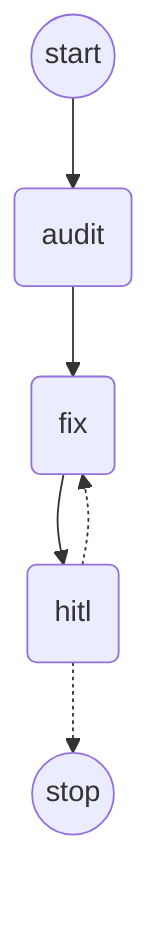

# 技术验证清单（tech-spike）

> 检索时间：2026-09-15。所有版本号均通过 **Maven Central 仓库元数据**（`repo1.maven.org/.../maven-metadata.xml`）与 **POM 父链**实际拉取确认，非记忆推测。
> 标注 `需验证` 的条目指「制品存在，但与本项目技术栈的组合兼容性尚未实机验证」。

## 0. 本机环境实测

| 项 | 结果 | 说明 |
|---|---|---|
| JDK | ✅ `17.0.12` (Oracle, `C:\Program Files\Java\jdk-17`) | 满足 SB 3.5 与 LangGraph4j 的 Java 17+ 要求 |
| Maven | ✅ `3.9.2` | |
| Node.js | ✅ `v24.11.1` | 满足 Vue3 + Vite（Vite 7 需 Node ≥20.19） |
| Docker | ⏸️ **未安装，用户决定暂缓（2026-09-15）** | 所有 🐳 卡片挂起；见 `docs/tasks.md` 的「Docker 延后影响清单」 |
| Git 仓库 | ❌ 未初始化 | 待执行 `git init` |

---

## 1. Spring Cloud Alibaba ↔ Spring Boot 3.x 兼容版本

**结论：确认可用。推荐基线 Spring Boot 3.5.x + Spring Cloud 2025.0.x + Spring Cloud Alibaba 2025.0.0.0。**

验证方法：拉取 `spring-cloud-alibaba-dependencies` 各版本 POM，读取 `<parent>` 指向的 `spring-cloud-dependencies-parent` 版本；再拉取对应 `spring-cloud-build` POM，读取 `<spring-boot.version>` 属性，形成完整父链。

| 发布线 | parent (`spring-cloud-dependencies-parent`) | → Spring Cloud | → Spring Boot（spring-cloud-build 实测值） |
|---|---|---|---|
| **2025.1.0.0** | 5.0.0 | 2025.1.x | **4.0.8** ← 超出「Spring Boot 3.x」要求，不用 |
| **2025.0.0.0** | 4.3.0 | 2025.0.x | **3.5.x** ← ✅ 推荐 |
| 2023.0.3.4 | 4.1.0 | 2023.0.x | 3.2.0 ← 保守备选 |
| 2023.0.3.3 | 4.1.0 | 2023.0.x | 3.2.0 |

实测父链证据：
- `spring-cloud-build:4.3.4` → `<spring-boot.version>3.5.15</spring-boot.version>`
- `spring-cloud-build:4.1.0` → `<spring-boot.version>3.2.0</spring-boot.version>`
- `spring-cloud-build:5.0.3` → `<spring-boot.version>4.0.8</spring-boot.version>`

SCA 2025.0.0.0 BOM 内管理的组件版本（实测 POM properties）：

| 组件 | 版本 |
|---|---|
| nacos-client | 3.0.3 |
| sentinel | 1.8.9 |
| seata | 2.5.0 |
| rocketmq | 5.3.1 |
| druid | 1.2.27 |
| fastjson2 | 2.0.58 |

**风险 / 需验证**
1. `需验证`：SCA 2025.0.0.0 官方声明支持的 Boot 版本区间，需以 `sca.aliyun.com` 版本说明页 + 实机 `mvn dependency:tree` 双重确认（本次网络受限，官方文档页未取到）。
2. `需验证`：Spring Boot 3.5.16（3.x 最新）与 `spring-cloud-build 4.3.4` 参考的 3.5.15 存在补丁号差异，建议先锁 **3.5.15**，冒烟通过后再升 3.5.16。
3. **Nacos Server 镜像 tag 需单独验证**：客户端是 3.0.3，服务端镜像 tag 必须与之兼容，不能沿用 2.x 镜像。
4. Spring Cloud 2025.1.x 起网关 starter 更名为 `spring-cloud-starter-gateway-server-webflux`；2025.0.x 仍为 `spring-cloud-starter-gateway`（实测 4.3.5 存在）。本项目用 2025.0.x，沿用旧名。

**替代方案**：若 SCA 2025.0.0.0 实机不兼容，降级到 SCA `2023.0.3.4` + Spring Cloud 2023.0.x + Boot 3.2.x（父链已验证一致，生态最成熟，但版本较旧）。

---

## 2. LangGraph 是否有可用 Java SDK

**结论：存在，且成熟度足够，推荐采用。不需要降级到方案 A（Python 服务）。**

- 坐标（实测存在）：`org.bsc.langgraph4j:langgraph4j-core`
- Maven Central 实测最新：`1.9.0-beta7`；**LTS 线最新为 `1.8.27`**
- 官方 README 声明：`1.8.x` 为 LTS（仅修复 + 小改进，分支 `support/1.8.x`）；`1.9.x` 为实验特性线
- JDK 要求：**Java 17+**（与本项目一致）
- 集成能力：内置 LangChain4j 与 **Spring AI** 适配模块
  - `org.bsc.langgraph4j:langgraph4j-langchain4j`
  - `org.bsc.langgraph4j:langgraph4j-agent-executor`
  - `org.bsc.langgraph4j:langgraph4j-studio`
  - `org.bsc.langgraph4j:langgraph4j-postgres-saver`（状态持久化）
  - 另有 `langgraph4j-bom` 统一管理版本
- 提供 Spring Boot starter 形态的集成模块（README 的 `spring-ai/springboot` 目录）

**推荐**：`org.bsc.langgraph4j:langgraph4j-core:1.8.27` + `langgraph4j-bom:1.8.27`。

**风险 / 需验证**
- ✅ **已解除**：S3 冒烟实测通过 —— 条件分支、循环边（HITL 驳回重跑）、状态 channel 合并、终止条件全部正常；
  与 Boot 3.5.15 依赖树零冲突。见 `LangGraphSmokeTest` + `SpikeGraphFixture`。
- ✅ **额外收益（F-2）**：原生支持 `GraphRepresentation.Type.MERMAID`，阶段 4 架构图可直接复用。
- `需验证`：国内社区项目、非 LangChain 官方出品。**引入生产代码前仍需保持依赖版本锁定**，避免 SNAPSHOT/beta 线。

---

## 3. LangHarness 是否有 Java SDK

**结论：未找到任何名为 LangHarness 的 Java SDK 或 Maven 制品。按「不存在」处理。**

验证方法：Maven Central 全文检索、Web 检索「LangHarness」「LangHarness Java SDK」「LangHarness evaluation framework」。检索结果全部指向 **「Harness Engineering」这一工程概念**（Agent 执行框架/评估脚手架）与 LangChain 的 *harness hill-climbing with evals* 方法论，**没有任何对应的 Java 库制品**。

**决策：采用自研轻量评测模块。**

自研评测模块的最小能力边界（阶段 9 落地）：
1. 数据集管理：测试项目 + 人工标注标准答案（JSON Schema 固定）。
2. 批量任务执行：对数据集逐项跑解析/审计/文档/修复流水线。
3. 指标计算：Bug 检出召回率、误报率、架构识别准确率、业务规则匹配率、文档质量评分。
4. 错误溯源：按流水线节点（仓库解析 / 静态解析 / 审计 / 修复 / 文档）归因。
5. 报告输出：Markdown + JSON 双格式，可入库比对历史。

**替代方案**：若后续希望引入成熟评测框架，可用 **LangChain4j 1.20.0** 的 `langchain4j-experimental-*` / `dev.langchain4j:langchain4j` 生态自建，或用 Python 侧 LangSmith（需引入跨语言服务，与全 Java 目标冲突，暂不采用）。

---

## 4. Tree-Sitter Java 绑定是否可用

**结论：确认可用，且是本次验证中「部署复杂度最低」的选项。无需拆独立解析服务。**

- 坐标（实测存在）：`io.github.bonede:tree-sitter`
- 最新版本：**`0.26.6`**
- Java 语言语法包：`io.github.bonede:tree-sitter-java`，最新 **`0.23.5`**
- 另有现成语法包（均已实测存在于 Maven Central）：`tree-sitter-python`(0.23.4)、`tree-sitter-javascript`(0.23.1)、`tree-sitter-typescript`(0.23.2)、`tree-sitter-kotlin`(0.3.8.1)、`tree-sitter-go`、`tree-sitter-rust`、`tree-sitter-c/cpp`、`tree-sitter-sql`、`tree-sitter-json`(0.24.8)、`tree-sitter-yaml`、`tree-sitter-xml`(itsaky) 等，共 115 个制品。

**关键优势（已从 README 实测确认）**
- **原生库随 jar 内置**（用 Zig 交叉编译），**无需本机安装 tree-sitter C 工具链、无需 `node-gyp`、无需手动编译 .dll/.so**。
- 明确支持 **`x86_64-windows`** ← 与本机（Windows 11 x64）匹配，这是本方案相对其他 Java 绑定的决定性优势。
- 同时支持 `x86_64-linux` / `aarch64-linux`（Docker 部署）、`x86_64-macos` / `aarch64-macos`。
- 支持从磁盘加载 `.so/.dll/.dylib`（`TSLanguage.load(path, name)`），便于后续动态扩展语言。
- 宣称 100% 覆盖 Tree-Sitter C API。

**风险 / 需验证**
- ✅ **已解除**：核心绑定 `0.26.6` 与语法包 `tree-sitter-java 0.23.5` 版本号虽不同源（语法包版本跟随上游 grammar），
  但实测 **C ABI 兼容**：core `TREE_SITTER_LANGUAGE_VERSION=15`、`MIN_COMPATIBLE=13`、java grammar `abiVersion=14`，落在支持区间内。
  见 S2 冒烟（`TreeSitterSmokeTest`）。
- ⚠️ **新的实现约束（F-1）**：该绑定返回的是 **UTF-8 字节偏移**，解析层必须按字节切片 + 显式 UTF-8 解码，
  禁止 `String.substring`，否则含中文的源码会切出乱码。详见第 8.1 节 F-1。
- `需验证`：Windows 下原生库随 jar 释放/加载是否被安全软件拦截 —— 本机实测未被拦截，可用。
- 备选：`io.github.itsaky:android-tree-sitter:1.4.3`（面向 Android，桌面端适配成本高，不推荐）；
  官方 `io.github.treesitter:jtreesitter` 在 Maven Central 未检索到该 group 制品，**不作为候选**。

---

## 5. JGit / MinIO / RabbitMQ 客户端推荐版本

| 用途 | 坐标 | 实测最新 | 推荐 | 风险 |
|---|---|---|---|---|
| Git 仓库拉取 | `org.eclipse.jgit:org.eclipse.jgit` | `7.8.0.202609011348-r` | **7.8.0.202609011348-r** | 7.x 需 Java 17 ✅ 满足。`需验证`：7.x 与 6.x API 有差异，以官方 JavaDoc 为准 |
| 对象存储 | `io.minio:minio` | `9.0.3`（8.x 线止于 `8.6.0`） | **8.6.0**（保守） | `需验证`：8→9 跨大版本，`MinioClient` API 可能变；除非确认 9.x 迁移指南，否则先用 8.6.0 |
| 消息队列 | `com.rabbitmq:amqp-client` | `5.36.0` | 由 `spring-boot-starter-amqp` 托管，**不显式指定** | 无。显式指定会覆盖 Boot 的版本仲裁，反而不安全 |

---

## 6. 其他已确认的关键依赖

| 用途 | 坐标 | 推荐版本 | 备注 |
|---|---|---|---|
| ORM | `com.baomidou:mybatis-plus-spring-boot3-starter` | **3.5.17** | 注意必须用 `-spring-boot3-` 变体；普通 `mybatis-plus-boot-starter` 不兼容 Boot 3 |
| 对象映射 | `org.mapstruct:mapstruct` | **1.6.3** | 1.7.0.Beta2 是 beta，不用 |
| API 文档 | `org.springdoc:springdoc-openapi-starter-webmvc-ui` | **2.9.1** | 实测其 parent = `spring-boot-starter-parent:3.5.16`，✅ 与 Boot 3.5.x 对齐。**3.x 线 parent 是 Boot 4.1.0，绝对不能用** |
| 网关 | `org.springframework.cloud:spring-cloud-starter-gateway` | 由 SC 2025.0.x BOM 托管（实测 4.3.5） | 2025.1.x 起更名，本项目不涉及 |
| LLM 框架（备选） | `dev.langchain4j:langchain4j` | **1.20.0** | 方案 B 使用；LangGraph4j 已内置其适配模块 |
| Spring AI | `org.springframework.ai:spring-ai-bom` | 2.0.1（实测存在） | `需验证`：2.x 可能要求 Boot 4，**引入前必须验证与 Boot 3.5.x 的兼容性**，否则用 1.x 线 |
| JDK 版本 | 本机 `17.0.12` | 锁定 **17** | 不用 21，避免与已验证的 SCA 组合产生额外变量 |

---

## 7. 降级方案评估（A / B / C）与推荐

| 方案 | 描述 | 优点 | 缺点 | 结论 |
|---|---|---|---|---|
| **A** | Java 业务微服务 + Python LangGraph 服务，REST/MQ 通信 | 用官方 Python LangGraph，能力最全 | 引入第二技术栈；跨语言状态序列化；部署/调试成本翻倍；违背「Java 为主」目标 | **不推荐**（预留为 2.x 逃生通道） |
| **B** | 全 Java，LangChain4j + 自研状态机 | 全 Java；生态活跃（1.20.0） | 状态机要自己写，图/分支/循环/检查点能力需自建 | 备选 |
| **C** | Spring StateMachine + 自定义 Agent 编排 | 与 Spring 生态无缝；概念成熟 | 面向传统状态机，**不擅长 LLM 的多轮循环 + 检查点 + 流式**，改造成本高 | 不推荐 |
| **✅ 首选** | **LangGraph4j 1.8.27（LTS）全 Java** | 图/分支/循环/检查点开箱即用；LangChain4j + Spring AI 双适配；Java 17+；LTS 线在维护 | 社区项目，非官方出品 | **采用** |

**推荐结论：首选 LangGraph4j（方案「全 Java」），若阶段 0 冒烟失败则降级到方案 A。**

---

## 8. 阶段 0 必须完成的冒烟验证（阻塞后续所有阶段）

按优先级排序，每项产出可执行的测试类 + 结论记录。**下方为 2026-09-15 实测结果。**

| # | 验证项 | 通过标准 | 结果 | 证据位置 |
|---|---|---|---|---|
| S1 | 全套技术栈依赖共存 (`dependency:tree`) | 无版本冲突告警 | ✅ **通过** | `docs/summaries/s1-dependency-tree.txt` |
| S2 | Tree-Sitter 解析 Java 源码 | 取到 `class_declaration` / `method_declaration` 节点名与行号 | ✅ **通过** | `TreeSitterSmokeTest`（3 测试） |
| S3 | LangGraph4j 建图执行 | 3 节点图含 1 条件分支跑通，拿到最终 state | ✅ **通过** | `LangGraphSmokeTest` + `SpikeGraphFixture`（3 测试） |
| S4 | JGit 拉取公开仓库 | 克隆成功，能读文件树 | ✅ **通过** | `JGitSmokeTest`（3 测试） |
| S5 | MinIO 连通 | 建桶、上传、下载、删除全通 | ⏸️ 等 Docker | — |
| S6 | Nacos 注册发现 | 一个服务注册，另一服务发现 | ⏸️ 等 Docker | — |
| S7 | Docker 环境 | `docker compose up -d` 起全部中间件 | ⏸️ 等 Docker | — |

> **S1~S4 全部通过，两个关键路径阻塞项（S2、S3）已解除，阶段 2/3/4+ 可开工。**

### 8.1 实测发现（实现时必须遵守）

**F-1｜Tree-Sitter 返回的是 UTF-8 字节偏移，不是字符偏移**（等级：高）

S2 第一版测试失败暴露：源码含中文（`订单服务`）时，`node.getStartByte()/getEndByte()` 是 UTF-8 字节偏移，
而 `String.substring()` 用 UTF-16 字符索引，直接切片会得到乱码（实测切出 `"ce implement"`）。

正确做法：
```java
byte[] bytes = source.getBytes(StandardCharsets.UTF_8);
String text = new String(bytes, node.getStartByte(), node.getEndByte() - node.getStartByte(), StandardCharsets.UTF_8);
```
**阶段 3 的解析器必须统一走该路径**，否则中文注释/标识符场景全错。

**F-2｜LangGraph4j 原生支持 Mermaid 生成**（等级：中，收益）

`compiledGraph.getGraph(GraphRepresentation.Type.MERMAID, "title", false)` 直接产出 `flowchart TD`，
含 `__START__` / `__END__` 合成节点、条件边虚线（`-.->`）、标题 YAML front-matter。实测输出示例：



→ **阶段 4 的 T-402 架构图可直接复用该能力**，无需自行拼接 Mermaid 字符串（至少 Agent 流程图部分）。

**F-3｜LangGraph4j 的流式 API 返回 `AsyncGenerator`，不是 `Stream`**（等级：低）

`CompiledGraph.stream(...)` 返回 `org.bsc.async.AsyncGenerator<E>`（实现 `Iterable`）。
需 `.map(...)` 后调用 `.stream()` 才能转成 Java Stream 做 `toList()`。

**F-4｜流式执行包含 `__START__` / `__END__` 合成节点**（等级：低）

`stream()` 的节点序列含首尾合成节点，断言节点执行顺序时必须计入。

**F-5｜Boot 3.5.15 托管的关键客户端版本**（等级：低，但与早期文档不同）

| 构件 | 实际解析版本 | 说明 |
|---|---|---|
| `com.rabbitmq:amqp-client` | **5.25.0** | 由 Boot 仲裁，**不要显式指定**（此前文档提到的 5.36.0 是 Maven Central 最新版，但覆盖 Boot 仲裁有风险） |
| `io.lettuce:lettuce-core` | **6.6.0.RELEASE** | 由 Boot 仲裁 |
| `com.mysql:mysql-connector-j` | **9.7.0** | 由 Boot 仲裁 |
| `com.alibaba.nacos:nacos-client` | **3.0.3** | 由 SCA 2025.0.0.0 仲裁，与文档一致 |
| `com.alibaba.csp:sentinel-*` | **1.8.9** | 由 SCA 2025.0.0.0 仲裁，与文档一致 |

**F-6｜本机 `github.com` 不可达，`gitee.com` 可达**（等级：高）

实测（2026-09-15）：

| 主机 | 结果 |
|---|---|
| `https://github.com` | ❌ 连接超时（http=000） |
| `https://codeload.github.com` | ✅ 301 |
| `https://raw.githubusercontent.com` | ✅ 301 |
| `https://gitee.com` | ✅ 200 |
| `https://repo1.maven.org` | ✅ 200 |

→ **GitHub 仓库导入链路本机无法端到端验证**。实现不得硬编码任一源；
GitHub 支持按 JGit 通用能力实现，但必须标注「本机未验证」。S4 已用 Gitee 完成等效验证。

**F-7｜JGit 7.8.0 浅克隆实测性能**（等级：低，供容量规划参考）

对 `gitee.com/y_project/RuoYi`：`--depth 1` 克隆约 **10 秒 / 18MB / 695 文件**（706 含 .git 内部文件）。
→ 大仓库导入必须走异步 + MQ（T-206），不可放在同步请求里。

**F-8｜H2 (MODE=MySQL) + Flyway 可在无 Docker 环境验证建表与 Mapper**（等级：中，收益）

`com.h2database:h2:2.3.232`（Boot 托管）配 `jdbc:h2:mem:...;MODE=MySQL;DATABASE_TO_LOWER=TRUE;CASE_INSENSITIVE_IDENTIFIERS=TRUE`
可直接跑生产用的 `V1__init_schema.sql`（Flyway `11.7.2`，无需额外 `flyway-database-h2`）。

**为兼容 H2 与 MySQL，建表脚本遵循两条约束**：
1. 索引一律用独立 `CREATE INDEX`，**不用** MySQL 的内联 `KEY (...)` 语法；
2. 不用 `ENGINE=` / `CHARSET=` 等表选项。

⚠️ **H2 是近似而非等价**：它证明的是「SQL 语法正确、列与映射符合预期」，
**真实 MySQL 8 的验证仍必须在 1B 阶段补做**（见 R-13）。

**F-9｜MyBatis-Plus 审计字段的两个真实陷阱**（等级：高，已在 T-201 踩到并修复）

| 陷阱 | 现象 | 正解 |
|---|---|---|
| `strictUpdateFill` 只在字段为 **null** 时填充 | 实体从库查出再改时 `updatedAt` **不变**，审计失效 | `updateFill` 用 `setFieldValByName` 无条件覆盖 |
| `LocalDateTime.now()` 是**纳秒**，列 `DATETIME(3)` 是**毫秒** | 写入再读回的值与内存值不等，断言假红 | 应用层 `truncatedTo(ChronoUnit.MILLIS)`；测试基准取库值 |

补充：`createdAt` 应加 `@TableField(fill = INSERT, updateStrategy = FieldStrategy.NEVER)`，
否则 `updateById` 会把 `created_at` 一并写回，审计字段失去不可变性。
以上三条均已有测试锁定（`PersistenceCrudTest`）。

**F-10｜Windows 上 Git pack 文件带只读属性**（等级：高，T-202 踩到并修复）

Git 写出的 `.git/objects/pack/*.pack|.idx` 在 Windows 上被标记为**只读**，
`Files.deleteIfExists` 遇到只读文件抛 `AccessDeniedException`。后果有两个，都很隐蔽：

| 现象 | 为什么难发现 |
|---|---|
| **重新导入同一项目必然失败**（工作区清空步骤抛异常） | 第一次导入永远是好的，坑在第二次 |
| **`mvn clean` 删不掉 `target/`**，构建直接中断 | 只有把测试工作区放在 `target/` 下才会遇到 |

**正解**：删除前逐个清掉只读位——
```java
path.toFile().setWritable(true);
Files.deleteIfExists(path);
```
**并且测试工作区不要放在 `target/` 下**，改用系统临时目录 + `@AfterAll` 清理
（见 `TestWorkspaces`）。已有回归测试锁死：`GitRepoFetcherTest.reclonesIntoExistingWorkspace`。

**F-11｜真实仓库导入实测**（等级：中，T-202 证据）

`https://gitee.com/y_project/RuoYi.git` 经完整链路（http 校验 → 浅克隆 → 剪枝 → 建树 → 落库）导入：

| 指标 | 实测值 |
|---|---|
| 检出分支 / HEAD | `master` / `7995a83e04e1a88aaea5a8a7c50570dffcb145e0` |
| 纳入文件数 | **624**（原工作区 695 文件，剪掉 `.git` 等 71 个） |
| 纳入总体积 | **9.1 MB** |
| 耗时 | 约 14 秒（含克隆） |

→ 印证 F-7 的结论：**导入必须异步化**（T-206），不可长期放在同步请求里（风险 R-15）。

**F-12｜JDK `ZipInputStream` 对非 ZIP 输入不报错**（等级：中，T-203 踩到并修复）

`new ZipInputStream(in).getNextEntry()` 读非 ZIP 数据时**返回 null 而不抛异常**，
于是「用户传了个 jpg，系统提示导入成功、0 个文件」。必须自行校验魔数：

```java
// PK\x03\x04 普通条目 / PK\x05\x06 空压缩包 / PK\x07\x08 分卷
byte[] header = buffered.readNBytes(4);   // 需先 mark/reset，否则流已被消耗
```

该行为无法从类型系统或文档察觉，只能靠测试发现——`ZipExtractorTest.rejectsNonZipFile` 已锁定。

**F-13｜Zip Slip 与 Zip Bomb 的实测防御要点**（等级：高）

| 要点 | 说明 |
|---|---|
| **只做 `contains("..")` 不够** | `a/b/../../../x` 这类写法绕得过朴素字符串检查，必须「规范化后仍在目标目录内」 |
| **绝对路径与盘符要单独拒** | `/etc/passwd`、`C:/x` 在 Windows 上都会脱离目标目录 |
| **反斜杠要统一转 `/`** | `..\x` 与 `../x` 等价，不转换会漏判 |
| **不能用 `ZipEntry.getSize()` 判断炸弹** | 那是包自己声明的大小，可以撒谎；只有实际写出的字节可信 |
| **只限总量挡不住炸弹** | 小包大解会在触达总量上限前先撑爆磁盘，必须同时限压缩比 |
| **符号链接无需特判** | 用 `OutputStream` 写内容而非 `Files.createSymbolicLink`，链接项退化为普通文件 |

实测覆盖 19 个用例（`ZipExtractorTest`），含 6 种穿越写法 + 3 类炸弹 + 畸形名 + 损坏输入。

**F-14｜`import_declaration` 与 `method_reference` 没有任何字段名**（等级：中，T-304 踩到并处理）

这两个节点用 `getFieldNameForChild` 取值**全部返回 null**，只能按子节点类型或顺序取：

| 节点 | 子节点结构 | 陷阱 |
|---|---|---|
| `import_declaration` | `import` → `static`? → `scoped_identifier`\|`identifier` → `asterisk`? → `;` | **通配符的 `scoped_identifier` 文本不含 `.*`**：`import java.util.*;` 里它的文本就是 `java.util`，`asterisk` 是**兄弟节点**。在文本里找 `*` 永远找不到 |
| `method_reference` | 限定符 → `::` → 成员名 或 `new` | `X::new` 的第二个子节点是 `new` **关键字节点**，只按 `identifier` 类型筛会漏掉「构造器引用」这一类 |

另：静态导入 `import static a.b.C.member;` 的完整文本是**成员路径**，最后一段是**成员名不是类型名**。
直接拿它建「简单名 → 类型」映射，会把 `requireNonNull` 当成一个类。

**F-15｜构造器体是 `constructor_body` 不是 `block`**（等级：高，T-304 踩到并处理）

只按 `block` 节点找方法体，会**静默漏掉全部构造器内的调用**——不报错、不抛异常，只是少一批边，
没有测试覆盖就永远发现不了。同一类「字段定位」陷阱还有两个：

| 陷阱 | 后果 | 正解 |
|---|---|---|
| `constructor_body` ≠ `block` | 构造器里的调用全丢 | 递归遍历全部子节点，不要按 `block` 筛 |
| `method_invocation.object` 无接收者时**缺失** | `requireNonNull(x)` 被当成 `this.requireNonNull(x)` | 用 `isNull()` 判「空节点」（同 F-9 的 `getChildByFieldName` 行为） |
| `type_arguments` 是 `name` **之前**的独立字段 | `this.<String>foo()` 按子节点下标取名字会取到泛型参数 | 一律走 `getChildByFieldName("name")` |

**F-16｜调用图的「不猜」原则**（等级：高，T-304 定策）

调用图里一条**假边**比缺一条边危害大得多：下游的循环依赖检测（T-404）、分层识别（T-401）
会被它带偏，而且假边与真边在输出里长得一模一样，无法人工识别。因此 `CallGraph` 的解析层定死几条：

- 解析不到就**不产边**，调用点留在 `unresolvedCallSites()` 里备查，不静默丢弃；
- 按需导入 `import a.b.*` 命中**多个**同名类时判歧义，不挑一个；
- 接收者是链式调用结果、数组下标等复杂表达式时**不推断**类型；
- 无接收者的调用按 JLS §6.5.6.1 先在本类型及其**工程内祖先**里找同名方法，找不到才落到静态导入，
  仍找不到就断边——顺序反了会把静态导入的方法挂到调用方自己头上，产出一条指向自身的假边；
- 目标类型在工程内但整条继承链上都没有该方法时，**不产边**（如 `StringBuilder`）；
- 工程外的类型（JDK / 三方）查不到方法表，按解析出的**显式 import** 原样记外部边，
  无 import 的隐式引用（`String`、`java.lang.*`）不计边，否则外部边会被噪声淹没。

已由 `CallGraphTest` 24 个用例锁定（含递归自环、`this(...)` 委派、同类互调、歧义、继承链、静态导入）。

---

**F-17｜Mermaid 图的离线校验：能验解析，验不了渲染**（等级：中，T-402 实测）

`docs/acceptance.md` 阶段 4 要求「能被 Mermaid 官方解析器**成功渲染**，不是只生成字符串」。
本机离线，逐项实测下来结论是一条**分界线**，必须分开说：

| 能力 | 结论 | 依据 |
|---|---|---|
| **解析**（语法是否合法） | ✅ **可离线验证**，已接入测试 | `mermaid@11.6.0` 的 `mermaid.parse()` 在 Node + jsdom 下给出干净布尔结果，且**会真的拒绝坏语法**（`Parse error on line N`）。跑的是 mermaid 包内的 jison 语法，与前端渲染同一份解析器 |
| **真实渲染**（出 SVG） | ❌ **离线不可验证** | `mermaid.render()` 需要 `SVGElement.getBBox()`，jsdom 没有布局引擎，实测报 `text2.getBBox is not a function`。要验只能上真实浏览器（`@mermaid-js/mermaid-cli` 内含 headless Chromium，体积大且需联网下载） |

**接线方式**：`tools/mermaid-verify/verify.mjs`，stdin 进图、退出码出结果，仅测试工具，
不参与 Java 构建（`mvn` 产出与它无关）。校验器**必须**的依赖与踩坑：

| 项 | 说明 |
|---|---|
| **必须注入 DOM** | 无 DOM 时 mermaid 会在解析**之后**的消毒环节抛 `DOMPurify.addHook is not a function`——那是环境缺 DOM，**不是语法错误**，直接按错误信息判失败会把好图判成坏的 |
| **`navigator` 只能 defineProperty** | Node 24 起 `navigator` 是只读全局，直接赋值抛 `TypeError` |
| **`mermaid` 自带的 DOMPurify 够用** | 只要 `window` 在，不需要手动注入 dompurify |

**标签转义实测**（把图喂给官方解析器逐字符试出来的，不是查文档抄的）：
引号标签 `["..."]` 里**只有双引号会真的解析失败**，`& # < > | ; , $ % @ ! * + = ? ~ ' \`` 与中文全部原样可用；
但**反斜杠在标签里是转义符**，会吞掉后一个字符（实测 `a/b\c` 渲染成 `a/bc`）——
这类是**静默内容丢失**，图照样解析通过，只是少一个字符。因此转义规则只需两条：
`"` → `#quot;`，`\` → `/`。

**代价**：每个解析进程要启动 Node + 加载 mermaid，约 4~5 秒；`MermaidGenTest` 跑 5 次解析，
给全量构建加了约 25 秒。**刻意不做批量化**——校验工具的第一要求是「一眼看得懂才有人信」，
为省十几秒把它改成多路复用协议不划算。

**未验证的边界**：本机只验证了**解析**。真正「前端能渲染出来」要等阶段 10 接 Vue3 时用真实浏览器验一次。

---

## 9. 未验证事项汇总（禁止在验证前当作既定事实）

**已闭环（2026-09-15 实测）**

- ~~SCA 2025.0.0.0 与 Boot 3.5.x 的依赖共存~~ → **S1 通过**（零 `omitted for conflict`）
- ~~Tree-Sitter `0.26.6` core ↔ `tree-sitter-java 0.23.5` 的 C ABI 兼容性~~ → **S2 通过**（ABI 14 ∈ [13,15]）
- ~~LangGraph4j 1.8.27 在 Boot 3.5.x 下的依赖树洁净度~~ → **S3 通过**
- ~~JGit 7.8.0 拉取公开仓库~~ → **S4 通过**（Gitee）
- ~~LangHarness 是否有 Java SDK~~ → **确认不存在**，走自研路线

**仍开放**

1. `需验证` SCA 2025.0.0.0 的**运行时**兼容性（Nacos 注册、Sentinel 限流实际生效）—— 依赖共存已证，运行时行为待 S6。
2. `需验证` MinIO SDK 8.6.0 的实际 API 与 9.x 迁移路径 —— 待 S5。
3. `需验证` Nacos Server 3.x 镜像 tag 与 `nacos-client 3.0.3` 的匹配关系 —— 待 S6/S7。
4. `需验证` `spring-ai-bom 2.0.1` 是否要求 Spring Boot 4.x —— 尚未引入，引入前必须验证。
5. `需验证` Spring Boot 3.5.16 相对锁定版本 3.5.15 的补丁差异 —— 当前锁 3.5.15 且冒烟全绿，无升级必要。
6. 🔴 **GitHub 导入链路本机不可验证**（`github.com` 不可达），见 F-6。
7. ⏸️ **Docker 未安装，容器化验证（S5/S6/S7）全部挂起** —— 用户 2026-09-15 决定暂缓。
8. `需验证` **Mermaid 图的真实渲染**（出 SVG）离线做不到：官方**解析器**已接入测试并通过（见 F-17），
   但渲染需要带布局引擎的真实浏览器。**因此现阶段只能说「图能被官方解析器解析」，
   不能说「图能渲染」**——"前端可渲染"要等阶段 10 用真实浏览器验一次。
